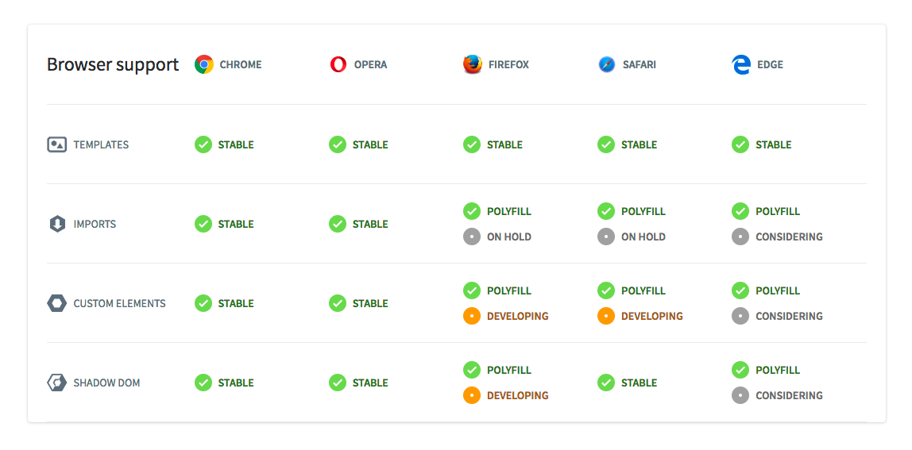

# Webapp From Scratch

## Description
This is a research project into the Web Components standards.

This little webapp shows you which asteroids will pass the earth soon. Some are even potentially hazardous! Will the end of the world come soon? Use this app to find out.

Master branch is directly pushed to the [live server](https://rijkvanzanten.github.io/minor-wafs/index.html).

This app was made using the Web Components standards. (Shadow DOM, HTML Templates, HTML Imports and Custom Elements).
Browser support at this time is lacking at best, but most browser vendors are working on implementing these standards.

## Web Components in a nutshell
**HTML Templates**
`<template></template>`

Html templates allow you to declare fragments of markup which are parsed as HTML, go unused at page load, but can be instantiated later on at runtime.

> They're a place to put a big wad of HTML that you don't want the browser to mess with at all... for any reason.
  - Rafael Weinstein (HTML Templates specification author)

**HTML Imports**
`<link rel="import" href="my-component.html" />`

HTML Imports is a way to include HTML documents in other HTML documents. This isn't limited to markup. An import can also include it's own CSS, JavaScript or anything else.

**Shadow DOM**
_From [Shadow DOM Fundamentals](https://developers.google.com/web/fundamentals/getting-started/primers/shadowdom)_
Shadow DOM is just normal DOM with two differences: 1) how it's created/used and 2) how it behaves in relation to the rest of the page. Normally, you create DOM nodes and append them as children of another element. With shadow DOM, you create a scoped DOM tree that's attached to the element, but separate from its actual children. This scoped subtree is called a shadow tree. The element it's attached to is its shadow host. Anything you add in the shadows becomes local to the hosting element, including <style>. This is how shadow DOM achieves CSS style scoping.

**Custom Elements**
With Custom Elements, developers can create new HTML tags, extend existing HTML tags, or extend the components other developers have build. It provides a web-standards way to create re-usable components using nothing more than vanilla JS/HTML/CSS.

## Resources
API for data: [NASA's open api](https://api.nasa.gov/index.html)

Great resources for getting started with webcomponents:
[webcomponents.org](http://webcomponents.org) - Polymer based webcomponents
[Custom Elements v1](https://developers.google.com/web/fundamentals/getting-started/primers/customelements) - Googles getting-started with elements guide
[Templates Introduction](https://www.html5rocks.com/en/tutorials/webcomponents/template/) - great html5rocks article about the inner workings of html template Elements
[Imports introduction](https://www.html5rocks.com/en/tutorials/webcomponents/imports/) - again, great html5rocks article about imports

## Take-aways on working with Web Components
### Templates
- Templates aren't in any way bound to data. Hydration of elements has to be done manually.
- HTML Templates can't be pre-rendered server-side.
- Elements inside a template is inert by default.
- Templates have no side effects whatsoever, until used.
- Content inside a template tag is considered not to be in the DOM.
- Templates can be placed everywhere (not only in the body)

### Imports
- `link rel=import` de-duplicates all request automatically.
- The imported document isn't placed in the DOM whatsoever, just made available for use.
- Script tags inside imported documents will run on import (!)
- Import statements are blocking by default, but accept the `async` attribute.
- When accessing `document` from within an to-be-imported document, you are actually accessing the parent document. `document.currentScript.ownerDocument` is the reference to the "child"-document.
- Deep-nested html imports will screw with `document.currentScript.ownerDocument`. Wrap in an iife with `document.currentScript.ownerDocument` as param to prevent this.

### Custom Elements
- Names must contain a hyphen (-) (f.e. `<asteroids-header>`)
- Name has to be unique
- Custom elements can't be self-closing
- You can extend existing HTML elements (like `HTMLButtonElement`) instead of the default `HTMLElement`. This will inherit all default functionality of this element (like tabindex on buttons).
- HTML Templates are an ideal way to markup the (Shadow) DOM of a custom element.
- Always add getter and setter methods for any and every attribute that your component will use.

### Shadow DOM
- Everything inside a shadow-root is scoped.
- Use `:host` selector to style parent container
- `position: fixed` uses the component as "viewport" => acts quite differently from what I expected.
- Styles of elements inside shadow-root can be overwritten from the light-dom.

## App Declarative Diagram

## To-do
- [ ] Change `asteroid-single` to a more fitting name
- [ ] Add more data to the asteroid details view
- [ ] Further research in creating a stable, modular router
- [ ] Create set of best-practices and code-style rules for web components

## License
The contents of this project are licensed under the MIT License.
